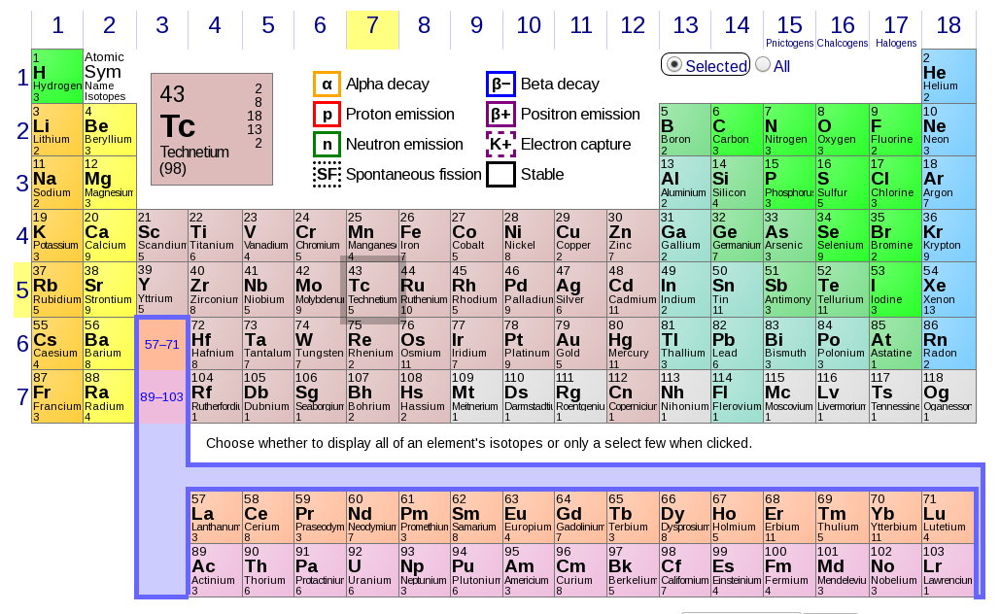

# Radiosotope activity

<!-- START doctoc generated TOC please keep comment here to allow auto update -->
<!-- DON'T EDIT THIS SECTION, INSTEAD RE-RUN doctoc TO UPDATE -->
**Table of Contents**  *generated with [DocToc](https://github.com/thlorenz/doctoc)*

- [Definitions](#definitions)
- [Applications](#applications)
  - [Medicine](#medicine)
- [Radioactivity decay](#radioactivity-decay)
  - [Nuclear medicine](#nuclear-medicine)
    - [Cold kits](#cold-kits)

<!-- END doctoc generated TOC please keep comment here to allow auto update -->

## Definitions

First, some key concepts

  - **Radioisotope**

    Also known as `radioactive isotope`, `radionuclide` or `radioactive nuclide`, is an [unstable
    atomic nucleus that loses part of its energy](https://sciencing.com/unstable-atom-10041703.html)
    emitting radiation, such as _alpha_, _beta_, and _gamma_ particles.

    > :point_right: [Every chemical element has one or more radioactive isotopes.](https://www.ptable.com/#Isotope)
    >
    > 

  - **Radiopharmaceutical**

    A drug labeled with a radioactive isotope. (see [Nuclear Medicine section](#nuclear-medicine)).

  - **Radioactivity decay** _(nuclear decay)_

    The loss or release of energy by radioisotopes.

  - **[Becquerel (`Bq`)](https://en.wikipedia.org/wiki/Becquerel)**

    Is the unit of radioactivity in the [International System of Units
    (SI)](https://en.wikipedia.org/wiki/International_System_of_Units), which is equal to one decay
    of the element per second.

    :black_small_square: 1 `Bq` = 1 decay/second

    > :point_right: An older activity unit, replaced by bequerel in 1970s and still used in some
    > fields, is the [Curie (Ci)](https://en.wikipedia.org/wiki/Curie).

    Since `Bq` is a small unit, radioactivity is often quantified in _kilobecqerels_ (`kBq`) or
    _megabecquerels_ (`MBq`).

    :black_small_square: 1 `kBq` = 1000 `Bq` = 10^3 `Bq`

    :black_small_square: 1 `MBq` = 1000 `kBq` = 1,000,000 `Bq` = 10^6 `Bq`

## Applications

Radioactive elements have many applications, such as determining the age of carbonaceous materials
([Carbon-14](https://en.wikipedia.org/wiki/Carbon-14)), industrial gauging
([Krypton-85](https://en.wikipedia.org/wiki/Krypton-85)), detection of explosives traces
([Nickel-63](https://en.wikipedia.org/wiki/Isotopes_of_nickel)), etc.

### Medicine

In medicine, certain radiosotopes are an **essential part of diagnostic procedures**, in combination
with imaging devices, besides being used to treat diseases such as hyperthyroidism, thyroid cancer,
as a method of pain relief in bone metastasis and also to sterilize medical instruments.

> :point_right: New procedures combine PET with computed X-ray tomography (CT) scans to give
> co-registration of the two images (PET-CT), enabling 30% better diagnosis than with a traditional
> gamma camera alone.  It is a very powerful and significant tool which provides unique information
> on a wide variety of diseases from dementia to cardiovascular disease and cancer. -
> [www.world-nuclear.org](http://www.world-nuclear.org/information-library/non-power-nuclear-applications/radioisotopes-research/radioisotopes-in-medicine.aspx)

Below, some of the most commonly used elements:

| Radioisotope   | Abbreviated form   |
| --------       |     :---------:    |
| Technetium-99m | $^{99m}Tc$         |
| Iodine-123     | $^{123}I$          |
| Iodine-131     | $^{131}I$          |
| Galium-67      | $^{67}Ga$          |
| Indium-111     | $^{111}In$         |

**TODO**: The elements used in Medicine are given to patients for imaging or treatment purposes. The
procedure is to give them certain quantity of the radioisotope (activity), that has been previously
calculated based on patient’s weight or on the study protocol.

## Radioactivity decay

The activity of a radioisotope depends on many factors (...) (**TODO**:complete)

Radiation of isotopes decays in exponential form and can be calculated with the $A =
A_o·{e}^{-\lambda \Delta t}$ formula, where

  * $A_o$ is the known initial activity,
  * $\lambda$ is the decay rate (a constant given for each radioisotope), and
  * $\Delta t$ is the difference of time between $A_o$ was measured and the time you want to perform
    the calculation for $A$.

    $\Delta t$ can be simplified as $t$, if you define $t$ as the time difference between the time of
    calibration of $A_o$ and the actual time.

In Nuclear Medicine, certain radioisotopes are used to acquire images of different parts of the
body, and also to treat some diseases like hyperthyroidism, thyroid cancer or as method of pain
relief in bone methastasis.

### Nuclear medicine

Radiopharmaceuticals can come ready to use or need preparation. The last ones are divided in two
parts:

#### Cold kits

Formed by vials that contains the pharmaceutical in solid state, Radioisotope, that has
to be added to the vial from the cold kit, to form finally the radiolabeled compound that will be
injected to the patient.

The most used radioisotope with cold kits is
[`Technetium-99m`](https://en.wikipedia.org/wiki/Technetium-99m), that can be obtained daily in the
building using a [`Mo99-Tc99 generator`](https://en.wikipedia.org/wiki/Technetium-99m_generator).

These generators come calibrated to have **certain activity (20Gbq or 25Gbq) at certain date**, and
when they are eluted, it gives `Tc99m-pertechnetate` with an amount of activity that depends on the
day of the week. So, for example, for the days of the week we would have:

| Day of week | Activity |
|-------------|---------:|
| Monday      | 1550 mCi |
| Tuesday     | 1100 mCi |
| Wednesday   |  870 mCi |
| Thursday    |  680 mCi |
| Friday      |  505 mCi |

The cold kit vials are prepared with an `activity` and `volume` that depends on the manufacturer, so
for example we have:

HDP -> 300 mCi in 5mL max volume
TTF -> 440 mCi in 6mL max volume
Nanocoloids -> 40 mCi in 2mL max volume

Depending on the day of the week and the cold kit that you want to prepare, you will need to
take a different volume from the `Tc99m` vial. For reference, to prepare `HDP` vial every day of the
week with the previous data:

| Day of week | Dose    |
|-------------|--------:|
| Monday      | 1,93 mL |
| Tuesday     | 2,72 mL |
| Wednesday   | 3,44 mL |
| Thursday    | 4,41 mL |
| Friday      | 6 mL    |

But, what happens if you make the elution at 8:00 and prepare the `HDP` at 11:00? If you measure the
activity of *Technetium* at 8:00 and have `1550 mCi`, at 11:00 you will have about 75% of that
activity, because of the radioactive decay:

| Time elapsed (h) | Activity |
|:----------------:|---------:|
|         0        |  1,550.0 |
|         1        |  1,381.9 |
|         2        |  1,232.1 |
|         3        |  1,098.5 |
|         4        |    979.4 |
|         5        |    873.2 |
|         6        |    778.6 |
